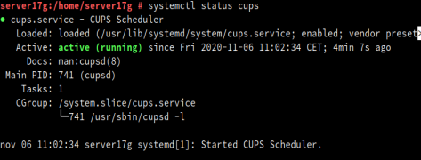

# Servidor de Impresión

Instalar en nuestra máquina el servicio de impresión cups:

En mi caso se puede ver que ya está instalado, ahora comprobemos que el servicio esta en ejecución con systemctl status cups:

Configuramos el fichero cupsd.conf en /etc/cups y cambiamos los @SYSTEM por @LOCAL y usamos el systemctl restart cupsd, ahora debería dejarnos entrar a la configuracion de la impresora con localhost, vamos a un navegador y lo comprobamos

Entramos en "Ver archivos de registro de acceso", y nos pedira la clave de acceso que sera la de usuario

# 3 Imprimir de forma localhost

Instalar el paquete cups-pdf que nos permite hacer uso de una impresora virtual PDF local. Usaremos esta impresora virtual para las pruebas en caso de no disponer de una impresora real y crear una archivo TXT o ODT con algún contenido, luego imprimir el documento en la impresora local.

# 4 Imprimir de forma remota

Habilitamos la impresora como recurso de red compartido y agregarla, la buscaremos por la ip del servidor y nos debe salir automáticamente

>No entiendo por que se guardan como mousepad_tarea cuando sus nombres son Imprimir_local y Imprimir_remoto
