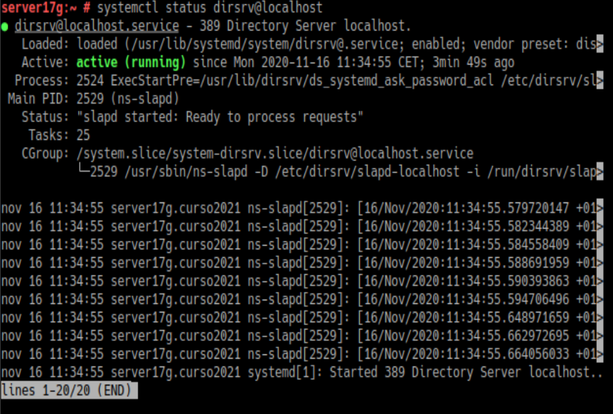
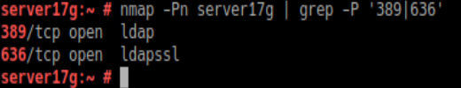
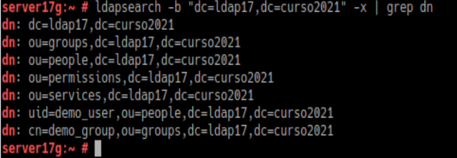
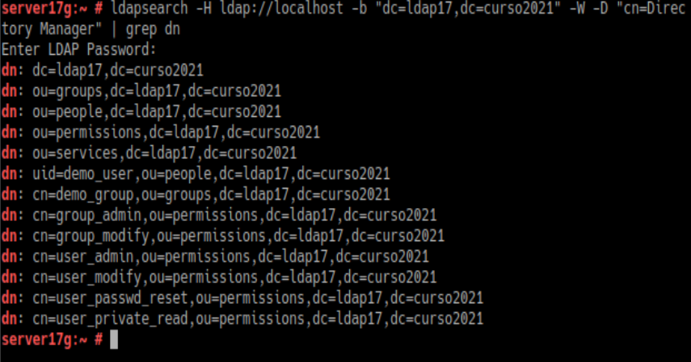
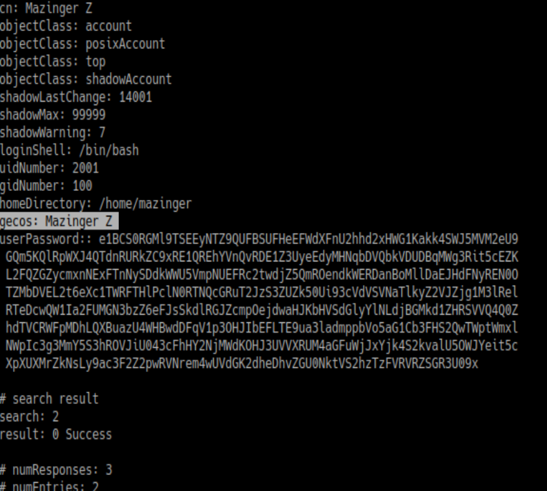
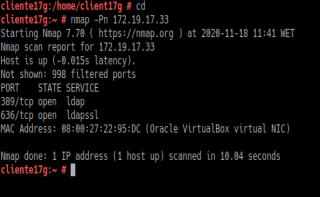
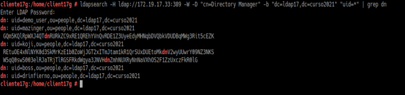

# Practica Ldap
## Rubrica :
### -2.4 Comprobar Contenido del DS Ldap
### -3.3 Comprobar Nuevo Usuario
### -4.3 Comprobar los Usuarios Creados

#### Info:
Antes de nada debemos estar seguros de que tenemos el servicio instalado y en funcionamiento:

Ademas comprobar que los puertos 389 y 636 están abiertos para el servicio:

## 2.4 Comprobamos el acceso al contenido Ldap

ldapsearch -b "dc=ldapXX,dc=curso2021" -x | grep dn, muestra el contenido de nuestra base de datos LDAP. "dn" significa nombre distiguido, es un identificador que tiene cada nodo dentro del árbol LDAP.

ldapsearch -H ldap://localhost -b "dc=ldapXX,dc=curso2021" -W -D "cn=Directory Manager" | grep dn, en este caso hacemos la consulta usando usuario/clave.

## 3.3 Comprobar el nuevo usuario

ldapsearch -W -D "cn=Directory Manager" -b "dc=ldapXX,dc=curso2021" "(uid=**)*, para comprobar si se ha creado el usuario correctamente en el LDAP.

## 4.3 Comprobar los usuarios creados

nmap -Pn IP-LDAP-SERVER, comprobar que el puerto LDAP del servidor está abierto:

Ejecutar comando ldpasearch -H ldap:///IP-LDAP-SERVER -W -D "cn=Directory Manager" -b "dc=ldapXX,dc=curso2021" "(uid=*)" | grep dn para consultar los usuarios LDAP que tenemos en el servicio de directorio remoto:

