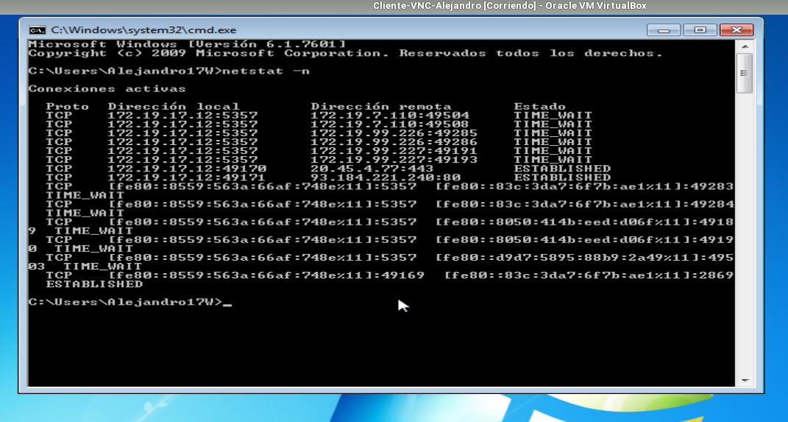
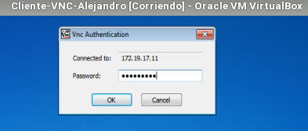
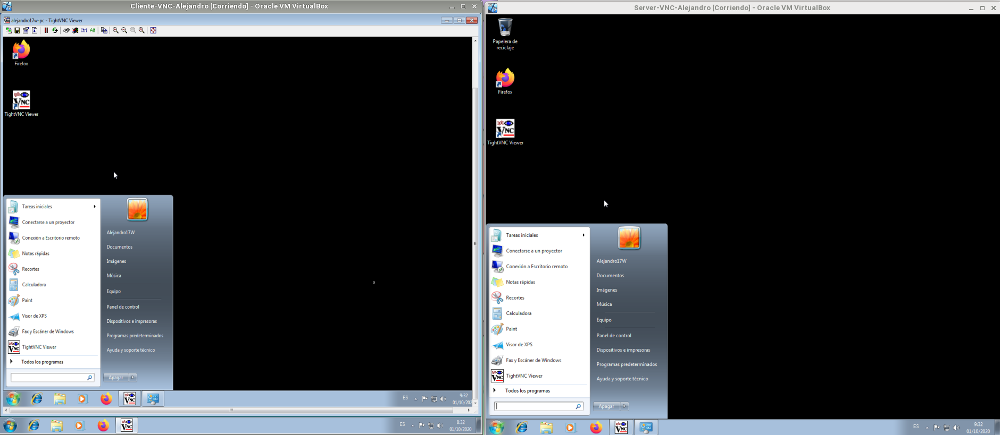

# Coneccion por VNC
### Windows Slave

>Descargar TightVNC y customizar como servidor

### Windows Master
> En el cliente instalar TightVNC como viewer

## _**Comprobaciones**_
Conseguir la ip del server Slave

Conectarnos mediante TightVNC usando la contraseña adecuada de dicha maquina esclavo

#### Comprobación final de conección mediante VNC

>Se puede apreciar que la pantalla se vuelve negra,he abierto el inicio de la maquina esclava para que se vea que estoy conectado desde la cliente a la esclava 
