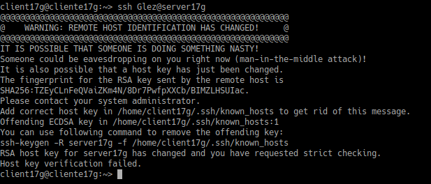

# Acceso Remoto SSH
## 1.1 Servidor SSH
Configuraremos el servidor Linux con los siguientes elementos:

-SO GNU/Linux OpenSUSE - Sin entorno gráfico

-El nombre del equipo sera serverXXg (en mi caso: server17g)

Debemos añadir en /etc/hosts los equipos clientes clientXXg y clientXXw (en mi caso client17g y client17w).

Para comprobar los cambios ejecutar los siguientes comandos:

## 1.2 Cliente GNU/Linux
Configuramos en cliente1 Linux con los siguientes valores:

-So OpenSUSE y el nombre clientXXg

-Añadir en /etc/hosts los equipos serverXXg y clientXXw y comprobamos haciendo ping a cada uno:

## 1.3 Cliente Windows
Instalar software SSH en Windows, en este caso usaremos PuTTY:

Añadir en C:\Windows\System32\drivers\etc\hosts los equipos serverXXg y clientXXw y lo comprobamos haciendo ping:

## 2 Instalación del servicio SSH en GNU/Linux"
-Instalamos openssh co zypper install openssh
## 2.1 Comprobación
Desde el server verificar su funcionalidad con:

## 2.2 Primera conexión SSH desde cliente GNU/Linux
Ir al client17g y hacer ping al serverXXg:

Una vez nos conectemos por primera vez por ssh al server se nos generara una clave de identificación de la maquina en $HOME/.ssh/known_hosts:

Ahora deberiamos poder conectarnos sin problema por ssh al server:

## 2.3 Primera conexión SSH desde cliente Windows
Desde el cliente Windows nos conectamos al servidor utilizando PuTTY:

## 3. Cambiamos la identidad del servidor
Ahora vamos a ver que pasaría si cambiamos las claves de nuestro servidor modificaremos el fichero de configuración SSH (/etc/ssh/sshd_config) para dejar una única línea: HostKey /etc/ssh/ssh_host_rsa_key el resto las comentamos.

## 3.1 Regenerar certificados
Ir al servidor y como usuario root ejecutamos ssh-keygen -t rsa -f /etc/ssh/ssh_host_rsa_key y no le pones password al certificado, reiniciamos el servicio ssh y comprobamos que esta en ejecución correctamente:

## 3.2 Comprobamos
Ahora comprobamo que sucede al volver conectarnos por ssh:

## 4. Personalización del prompt Bash
Podemos añadir las siguientes líneas al fichero de configuración del 1er-apellido-alumno1 en la máquina servidor (Fichero /home/1er-apellido-alumno1/.bashrc)

Además, crear el fichero el fichero /home/1er-apellido-alumno1/.alias, donde pondremos el siguiente contenido:

## 5. Autenticación mediante claves públicas
Vamos a la máquina clientXXg.
¡OJO! No usar el usuario root.
Iniciamos sesión con nuestro el usuario nombre-alumno de la máquina clientXXg.
ssh-keygen -t rsa para generar un nuevo par de claves para el usuario en:

    /home/nombre-alumno/.ssh/id_rsa
    /home/nombre-alumno/.ssh/id_rsa.pub

Ahora vamos a copiar la clave pública (id_rsa.pub), al fichero "authorized_keys" del usuario remoto 1er-apellido-alumno4 que está definido en el servidor.

    Hay varias formas de hacerlo.
    El modo recomendado es usando el comando ssh-copy-id. Ejemplo para copiar la clave pública del usuario actual al usuario remoto en la máquina remota: ssh-copy-id 1er-apellido-alumno4@serverXXg
    

## 6. Uso de SSH como túnel para X
Instalar en el servidor una aplicación de entorno gráfico (APP1) que no esté en los clientes. Por ejemplo Geany. Si estuviera en el cliente entonces buscar otra aplicación o desinstalarla en el cliente.

Modificar servidor SSH para permitir la ejecución de aplicaciones gráficas, desde los clientes. Consultar fichero de configuración /etc/ssh/sshd_config (Opción X11Forwarding yes)

Reiniciamos el servicio SSH.

Vamos a clientXXg y ejecutamos zypper se APP!, para comprobar qu no este ya instalado

Vamos a comprobar desde clientXXg, que funciona APP1(del servidor).

    ssh -X primer-apellido-alumno1@serverXXg

Nos conectamos de forma remota al servidor, y ahora ejecutamos APP1 de forma remota.

## 7. Aplicaciones Windows nativas
Podemos tener aplicaciones nativas de windows instaladas en ssh-server, instalamos el emulador wine en serverXXg

Ahora podríamos instalar alguna aplicación (APP2) de Windows en el servidor SSH usando el emulador Wine. O podemos usar el Block de Notas que viene con Wine: wine notepad.

## 8. Restricciones de uso
Vamos a modificar los usuarios del servidor SSH para añadir algunas restricciones de uso del servicio.

## 8.1 Restricción sobre un usuario
Vamos a crear una restricción de uso SSH para un usuario:

En mi caso le denegar el servicio SSH a mi usuario ssh Glez2, hiremos al fichero /etc/ssh/sshd_config y lo modificaremos con la siguiente linea:

 Comprobar que la sintaxis del fichero de configuración es correcta:

 
