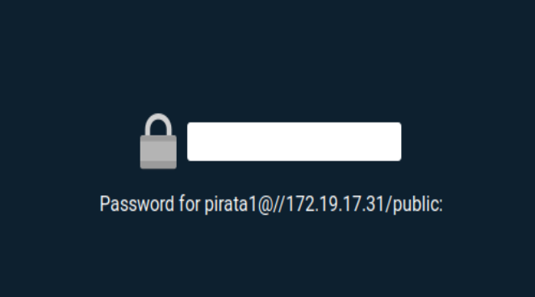

# Samba con Opensuse y Windows
## 1.- Usuarios locales
Crear los grupos 'piratas', 'soldados' y 'sambausers' y crear el usuario 'sambaguest'

Crear los siguientes usuarios dentro de sus respectivos grupos

Piratas: pirata1, pirata2 y supersamba

Soldados: soldado1, soldado2, supersamba

sambausers: piarat1, pirata2, soldado1, soldado2, sambaguest y supersamba

## 1.3 Crear las carpetas para los futuros recursos compartidos

Creamos los recursos de red

Crearemos la carpeta samba17 y sus respectivas capertas (barco.d, castillo.d, public.d)

## 1.4 Configurar el servidor samba
Hacemos una copia de seguridad del fichero de configuración antes de modificarlo

Vamos a Yast -> Samba server y pondremos:

-Workgroup: curso2021

-Sin controlador de dominio

En la pestaña inicio definimos lo siguiente:

-Iniciar el servicio durante el arranque de la maquina

-Ajustes del cortafuegos -> Abrir puertos

## 1.5 Crear los recursos compartidos de red

Tendremos que configurar los recursos compartidos, se pueden hacer desde Yast o desde el terminal

>Por alguna razón desde Yast no aparece la configuración global, recomiendo que se configure desde el terminal

En mi caso lo he configurado desde el terminal en el fichero /etc/samba/smb.conf y configuramos los recursos:

-global

-public

-castillo

-barco

Usamos el comando 'testparm' para verificar la sintaxis

## 1.6 Usuarios samba

'smbpasswd -a (Usuario)' para crear una clave smb al usuario

Y haremos un 'pdbedit -L' para comprobarlo

## 1.7 Reiniciar

Ahora que hemos terminado con el servidor solo nos queda reiniciar el servicio

En mi caso he utilizado 'systemctl restart smb' y 'systemctl restart nmb'.

Y utilizamos el comando 'sudo lsof -i' para comprobar que el servicio esta a la escucha

# 2 Windows
## 2.1 Cliente Windows GUI

Desde un cliente Windows acceder a los recursos compartidos, escribimos '\\\ip-del-servidor-samba' y nos aparecera lo siguiente:

  

Asegurarnos que no hay conexiones abiertas:

Si las hubiese utilizamos el comando 'net use * /d /y'

Accedemos al recurso compartido public:

Accedemos al recurso compartido castillo:

Accedemos al recurso compartido barco:

Ahora comprobaremos desde el servidor Samba los siguientes comandos:

'smbstatus':

'lsof -i':

## 2.2 Cliente Windows comandos

Vamos a verlos recursos compartidos de esta maquina con:

Ahora vamos a montar el recurso barco de forma persistente:

Comprobamos con net use:

Vamos al server y comprobamos también con:

'smbstatus'

'lsof -i':

# 3 Cliente GNU/Linux
## 3.1 Cliente GNU/Linux GUI

Desde el entorno grafico accedemos a los recursos compartidos castillo y barco y probamos a crear carpetas dentro de ellos

Como se observa nos deja perfectamente crear carpetas

Comprobamos:

'smbstatus':

'sudo lsof -i':

## 3.2 Cliente GNU/Linux Comandos

Vamos a un equipo GNU/Linux que sera nuestro cliente y probamos el comando 'smbclient --list IP-SERVIDOR-SAMBA'

Ahora crearemos en local la carpeta '/mnt/remoto17/castillo' y montamos el recurso compartido de Samba Server como si fuera una carpeta mas de nuestro sistema y haremos 'df -hT' para verificar que se ha montado:

Comprobamos de nuevo con 'smbstatus' y 'lsof -i':

## 3.3 Montaje Automático

Reiniciamos la maquina y veremos que ahora no esta montado con 'df -hT':

El montaje fue temporal

Para configurar el montaje automático nos vamos al fichero '/etc/fstab' y ponemos la siguiente linea de código:

'//IP-servidor-samba/public /mnt/remotoXX/public cifs username=soldado1,password=clave 0 0'

Reiniciamos el equipo y comprobamos que se monta automáticamente al arrancar

  

  

### Curiosidad

En caso de que al montarlo automáticamente no le indiquemos una clave entonces, nos pedirá la clave del  usuario que hallamos automatizado:

  

La clave sera la clave que le hallamos generado con el comando 'smbpasswd -a Usuario' (Punto 1.6)
