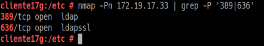
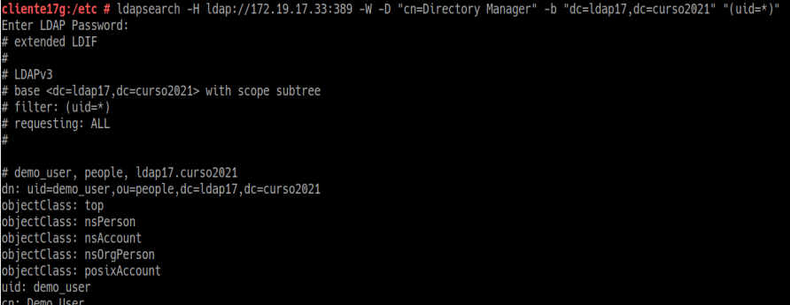
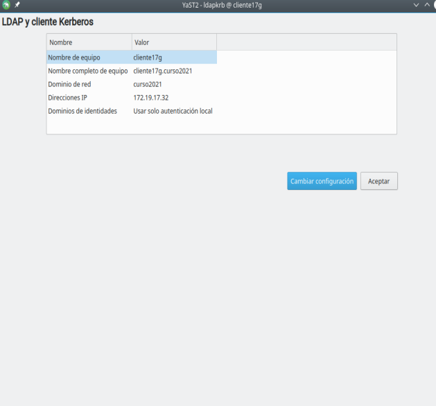
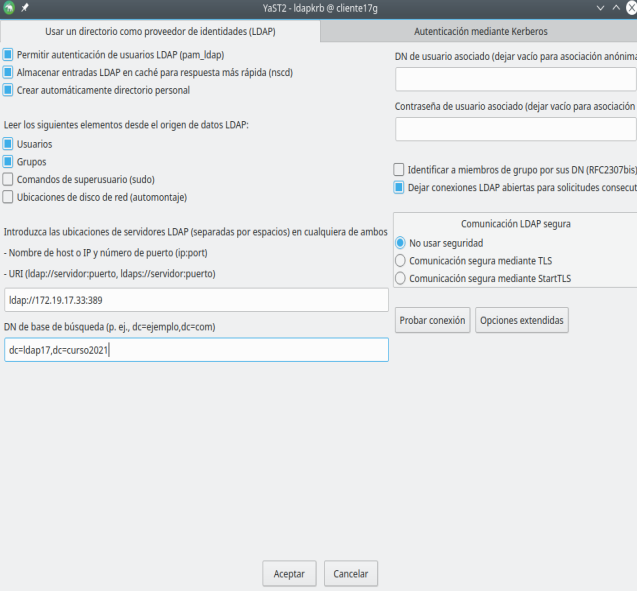
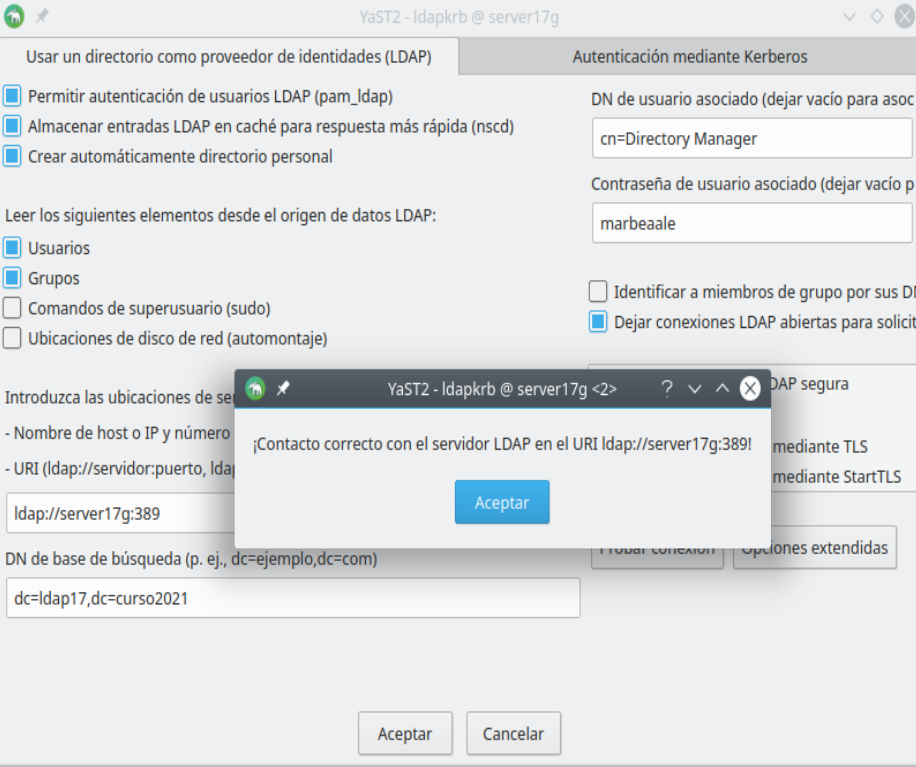
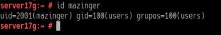
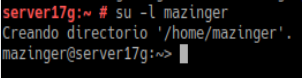
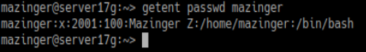
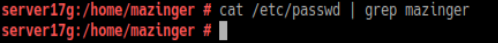

# Cliente para autenticación LDAP
### 1. Preparativos

Ir a MV Cliente

nmap -Pn 172.19.17.33 | grep -P '389|636'

ldapsearch -H ldap://172.19.17.33:389 -W -D "cn=Directory manager" -b "dc=ldap17,dc=curso2021" "(uid=*)" | grep dn

## 2. Configurar auntenticación LDAP

### 2.1 Crear conexión con el servidor

Ir MV Cliente

Asegurarnos de tener el hostname y el hosts bien

Ir a Yast -> cliente LDAP y Kerberos

Configurar como la imagen de ejemplo:

Al final Probar conexión

## 2.2 Comprobar conexiones

id mazinger

su -l mazinger

getent passwd mazinger

cat /etc/passwd | grep mazinger

