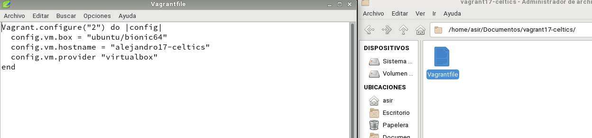
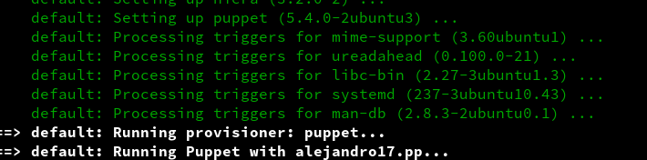

# Vagrant con VirtualBox
## 1.Instalar Vagrant

Instalar Vagrant.

Si vamos a trabajar Vagrant con MV de VirtualBox, hay que comprobar que las versiones de ambos son compatibles entre sí.

  vagrant version, para comprobar la versión actual de Vagrant.

## 2.Proyecto Celtics
### 2.1 Imagen, caja o box

vagrant box add BOXNAME, descargar la caja que necesitamos a través de vagrant.

vagrant box list, lista las cajas/imágenes disponibles actualmente en nuestra máquina.

### 2.2 Directorio

Crear un directorio para nuestro proyecto. Donde XX es el número de cada alumno

Crear el fichero Vagrantfile de la siguiente forma:

### 2.3 Comprobar

Debemos estar dentro de vagrantXX-celtics.

vagrant up, para iniciar una nueva instancia de la máquina.

Veremos que se a creado la maquina en nuesto VirtualBox

vagrant ssh: Conectar/entrar en nuestra máquina virtual usando SSH.

## 3. Proyecto Hawks
### 3.1 Creamos proyecto Hawks

Crear carpeta vagrantXX-hawks. Entrar en el directorio.

Crear proyecto Vagrant.

Configurar Vagrantfile para usar nuestra caja BOXNAME y hostname = "nombre-alumnoXX-hawks".

Modificar el fichero Vagrantfile, de modo que el puerto 4567 del sistema anfitrión sea enrutado al puerto 80 del ambiente virtualizado.

config.vm.network :forwarded_port, host: 4567, guest: 80

vagrant ssh, entramos en la MV

Veremos que se ha realizado la configuración de puertos

Instalamos apache2.

Hacemos un vagrant reload en el caso de que queramos actualizar la caja

### 3.2 Comprobar

En el HOST-CON-VAGRANT (Máquina real). Comprobaremos que el puerto 4567 está a la escucha.

vagrant port para ver la redirección de puertos de la máquina Vagrant.

En HOST-CON-VAGRANT, abrimos el navegador web con el URL http://127.0.0.1:4567. En realidad estamos accediendo al puerto 80 de nuestro sistema virtualizado.

## 4. Suministro

vagrant halt, apagamos la MV.

vagrant destroy y la destruimos para volver a empezar.

### 4.1 Proyecto Lakers (Suministro mediante shell script)

Crear directorio vagrantXX-lakers para nuestro proyecto.

Entrar en dicha carpeta.

Crear la carpeta html y crear fichero html/index.html con el siguiente contenido:

Crear el script install_apache.sh, dentro del proyecto con el siguiente contenido:

Incluir en el fichero de configuración Vagrantfile lo siguiente:

config.vm.hostname = "nombre-alumnoXX-lakers"

config.vm.provision :shell, :path => "install_apache.sh", para indicar a Vagrant que debe ejecutar el script install_apache.sh dentro del entorno virtual.

config.vm.synced_folder "html", "/var/www/html", para sincronizar la carpeta exterior html con la carpeta interior. De esta forma el fichero "index.html" será visible dentro de la MV.

vagrant up, para crear la MV.

>Podremos notar, al iniciar la máquina, que en los mensajes de salida se muestran mensajes que indican cómo se va instalando el paquete de Apache que indicamos.

Para verificar que efectivamente el servidor Apache ha sido instalado e iniciado, abrimos navegador en la máquina real con URL http://127.0.0.1:4567.

### 4.2 Proyecto Raptors (Suministro mediante Puppet)

Crear directorio vagrantXX-raptors como nuevo proyecto Vagrant.

Modificar el archivo Vagrantfile de la siguiente forma:

Ahora hay que crear el fichero manifests/nombre-del-alumnoXX.pp, con las órdenes/instrucciones Puppet para instalar un programa determinado

vagrant up

Ahí se puede apreciar que se a instalado correctamente el paquete que le solicite a puppet en este caso php

## 5 Proyecto Bulls

### 5.1 Preparar la MV VirtualBox

Crear una MV VirtualBox nueva o usar una que ya tengamos.

Instalar OpenSSH Server en la MV en mi caso ya estaba instalando

Ir a la MV de VirtualBox:

su

useradd -m vagrant

su - vagrant

mkdir -pm 700 /home/vagrant/.ssh

wget --no-check-certificate 'https://raw.github.com/mitchellh/vagrant/master/keys/vagrant.pub' -O /home/vagrant/.ssh/authorized_keys

chmod 0600 /home/vagrant/.ssh/authorized_keys

chown -R vagrant /home/vagrant/.ssh

#### sudoers

Añadir vagrant ALL=(ALL) NOPASSWD: ALL a /etc/sudoers.

#### Añadir las VirtualBox Guest Additions

Debemos asegurarnos que tenemos instalado las VirtualBox Guest Additions con una versión compatible con el host anfitrión.

root@hostname:~# modinfo vboxguest |grep version

Apagar la MV

### 5.2 Crear caja Vagrant

Vamos a crear una nueva carpeta vagrantXX-bulls, para este nuevo proyecto vagrant.

VBoxManage list vms, comando de VirtualBox que muestra los nombres de nuestras MVs. Elegiar una de las máquinas (VMNAME).

Nos aseguramos que la MV de VirtualBox VMNAME está apagada.

vagrant package --base VMNAME nombre-alumnoXX.box, parar crear nuestra propia caja.

Comprobamos que se ha creado el fichero nombre-alumnoXX.box en el directorio donde hemos ejecutado el comando.

vagrant box add nombre-alumno/bulls nombre-alumnoXX.box, añadimos la nueva caja creada por nosotros, al repositorio local de cajas vagrant de nuestra máquina.

vagrant box list, consultar ahora la lista de cajas Vagrant disponibles.

### 5.3 Usar la nueva caja

Crear un nuevo Vagrantfile para usar nuestra caja.

Levantamos la MV.

Nos debemos conectar sin problemas (vagant ssh).

