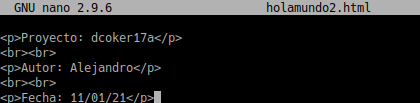

# Contenedores con Docker
### Rubrica
1.3 Primera prueba
3.2 	Comprobar 			
3.3 	Migrar imagen 			
4.2 	Crear imagen Dockerfile 			
4.3 	Crear contenedor 			
4.4 	Usar imagen de nginx 			
5 	Hola Mundo 	

## 1.3 Primera prueba

  docker run hello-world, este comando hace lo siguiente:

  Descarga una imagen "hello-world"

  Crea un contenedor y

  ejecuta la aplicación que hay dentro.

  

  docker images, ahora vemos la nueva imagen "hello-world" descargada en nuestro equipo local.

  docker ps -a, vemos que hay un contenedor en estado 'Exited'.

  

  docker stop IDContainer, parar el conteneder.

  docker rm IDContainer, eliminar el contenedor.

  

## 3.2 Comprobar contenedor nginx

Abrimos una nueva terminal.

docker ps, nos muestra los contenedores en ejecución. Podemos apreciar que la última columna nos indica que el puerto 80 del contenedor está redireccionado a un puerto local 0.0.0.0.:PORT -> 80/tcp.

Abrir navegador web y poner URL 0.0.0.0.:PORT. De esta forma nos conectaremos con el servidor
Nginx que se está ejecutando dentro del contenedor.

Comprobar el acceso a holamundo.html.

Paramos el contenedor app2nginx1 y lo eliminamos.

## 3.3 Migrar la imagen a otra máquina

Exportar imagen Docker a fichero tar:

docker save -o ~/alumnoXX.tar nombre-alumno/nginx1, guardamos la imagen "nombre-alumno/nginx1" en un fichero tar.

Intercambiar nuestra imagen exportada con la de un compañero de clase.

Importar imagen Docker desde fichero:

Coger la imagen de un compañero de clase.

Nos llevamos el tar a otra máquina con docker instalado, y restauramos.

docker load -i ~/alumnoXX.tar, cargamos la imagen docker a partir del fichero tar. Cuando se importa una imagen se muestra en pantalla las capas que tiene. Las capas las veremos en un momento.

docker images, comprobamos que la nueva imagen está disponible.

Probar a crear un contenedor (app3alumno), a partir de la nueva imagen.

## 4.1 Preparar ficheros

Crear directorio /home/nombre-alumno/dockerXXa.

Entrar el directorio anterior.

Crear fichero holamundo2.html con:

Proyecto: dockerXXa

Autor: Nombre del alumno

Fecha: Fecha actual

Crear el fichero Dockerfile con el siguiente contenido:

## 4.2 Crear imagen a partir del Dockerfile

El fichero Dockerfile contiene toda la información necesaria para construir el contenedor, veamos:

cd dockerXXa, entramos al directorio con el Dockerfile.

docker build -t nombre-alumno/nginx2 ., construye una nueva imagen a partir del Dockerfile. OJO: el punto final es necesario.

docker images, ahora debe aparecer nuestra nueva imagen.

## 4.3 Crear contenedor y comprobar

A continuación vamos a crear un contenedor con el nombre app4nginx2, a partir de la imagen nombre-alumno/nginx2. Probaremos con: docker run --name=app4nginx2 -p 8082:80 -t nombre-alumno/nginx2

Desde otra terminal:

docker ps, para comprobar que el contenedor está en ejecución y en escucha por el puerto deseado.

Comprobar en el navegador:

  URL http://localhost:PORTNUMBER

  URL http://localhost:PORTNUMBER/holamundo2.html

  

## 4.4 Usar imágenes ya creadas

Crea el directorio dockerXXb.

Entrar al directorio.

Crear fichero holamundo3.html con:

    Proyecto: dockerXXb
    Autor: Nombre del alumno
    Fecha: Fecha actual

Crea el siguiente Dockerfile

Poner el el directorio dockerXXb los ficheros que se requieran para construir el contenedor.

docker build -t nombre-alumno/nginx3 ., crear la imagen.

docker run --name=app5nginx3 -d -p 8083:80 nombre-alumno/nginx3, crear contenedor.

Comprobar el acceso a "holamundo3.html".

## 5. Docker Hub

Crear carpeta dockerXXc. Entrar en la carpeta.

Crear fichero Dockerfile de modo que al ejecutar este comando docker run nombre-alumno/holamundo

Se mostrará en pantalla el mensaje siguiente:

Registrarse en Docker Hub.

docker login, para abrir la conexión.

docker push ..., para subir la imagen a los repositorios de Docker.

