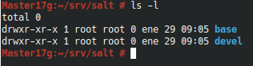

# Salt Stack
## 3.4 Comprobar conectividad
Instalar el servicio salt-Master: zypper install salt-master.service

Instalar el servicio salt-minion: zypper install salt.minion.service

Aceptar al minion

Comprobar conectividad

## 4.5 Aplicar estados (apache)

Creamos ddirectorio base y devel donde guardaremos los estados

Creamos el root.conf

Creamos el init.sls

Utilizamos el comando salt '*' state.apply apache

Se ha aplicado correctamente el estados

## 5.1 Aplicar estados (users)

Creamos el init.sls con los parametros para crear los usuarios dentro del grupo mazinger

Aplicamos el estado con el comando salt '*' state.apply users

Podemos comprobar como se aplicaron los 3 usuarios correctamente

## 5.2 Aplicar estados (files)

Creamos el init.sls designando sus directorios y colocamos sus respectivos permisos

Aplicamos el estado con el comando salt '*' state.apply files

Se aplico el estado correctamente

## Intento de ampliación de estado apache

 
